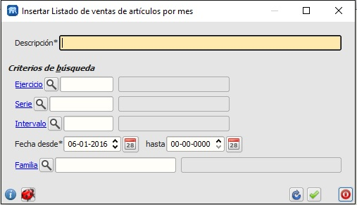

====================================================
Informe de unidades vendidas de cada artículo de una familia en cada mes o intervalo
====================================================

Informe de unidades vendidas de cada artículo de una familia en cada mes o intervalo.
Muestra todos los artículos de esa familia.
Se pueden definir intervalos distintos al mes natural

---------------------
Módulos que necesitan estar instalados previamente
---------------------

    * "informes" name="flfactinfo"
    * "facturacion" name="flfacturac"
    * "principal" name="flfactppal"
    * "almacen" name="flfactalma"
    

---------------------
Extensiones que necesitan estar instaladas previamente
---------------------

Ninguna

-------

---------------------
Capturas de pantalla
---------------------

   
   Edición de criterios de selección.
   
------

.. figure:: ./doc/ext0039-resultado-informe-ventas-mes.jpg
   :width: 500px
    
   Resultado-salida de un ejemplo de informe.
   
------

.. figure:: ./doc/edicion_articulo.png
   :width: 500px
    
   Edición de artículo.
