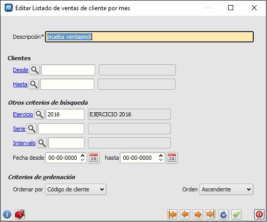
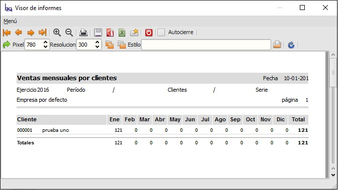

====================================================
Informe de ventas mensuales por clientes
====================================================

Informe/listado de clientes con el valor de las ventas en cada mes o intervalo.

Se pueden definir intervalos distintos al mes natural.

Es un listado de clientes donde aparecen los totales facturados desglosado en meses.

---------------------
Módulos que necesitan estar instalados previamente
---------------------

    * "facturacion/informes" name="flfactinfo"

---------------------
Extensiones que necesitan estar instaladas previamente
---------------------

   * Ninguna

---------------------
Capturas de pantalla
---------------------

   
   Edición de criterios de selección.
   
------

    
   Resultado-salida de un ejemplo de informe.
   
------

    
   Icono y titulo del menú en informes.
   
------
